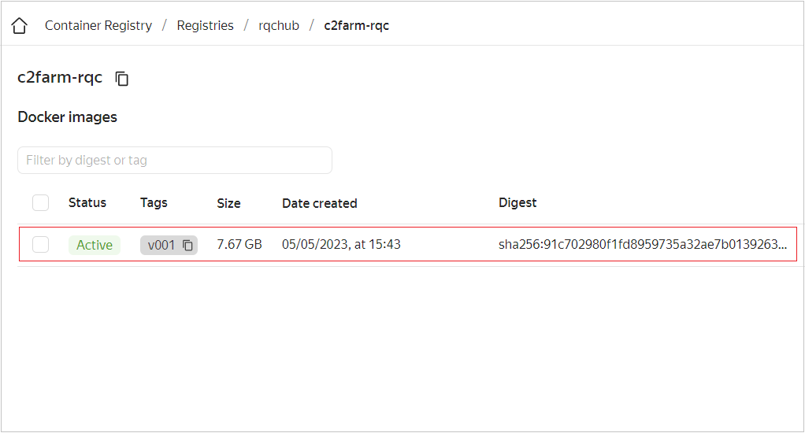

# rl_docker

<!-- ABOUT THE PROJECT -->
This Docker image contains a robot learning algorithm called [C2F-ARM](https://github.com/stepjam/ARM). The Docker image is intended to simplify creating and running various configurations for training [UR5e robot arm](https://www.universal-robots.com/products/ur5-robot/) to perform grasping tasks.

<!-- GETTING STARTED -->
## Getting Started

To get a local copy up and running, follow these steps.

### Prerequisites

* The container is based on Docker, so you need to [install Docker](https://docs.docker.com/engine/install/ubuntu/) first.
  

### Installation

1. Clone the repo
   ```sh
   git clone https://github.com/RQC-Robotics/rl_docker.git
   ```  
2. Change director
   ```sh
   cd rl_docker/
   ```
3. Build Docker image
   ```sh
   sudo docker build -t c2farm-rqc:v01 .
   ```
4. Run Docker container
   ```js
   sudo docker run --privileged -p 6006:6006 --name c2farm-rqc --rm -ti --gpus all c2farm-rqc:v01
   ```
5. Change Ngrok address and port in ./ARM/arm/env_client.py
   ```js
   vi ./ARM/arm/env_client.py
   ```
6. Run server script on the Robot server at Lab
   ```js
   python server_c2farm.py
   ```
7. Upload zip archive with demos to Yandex Object Storage (c2farm folder)
   ```
   You can skip this step depending on your use case. The demos used in this container are already available at this link: https://rl-docker.storage.yandexcloud.net/c2farm/myDemoKinect-v01.zip
   ```
8. Run training process using Docker container console. 
   ```
   source run_c2farm_training.sh myDemoKinect-v01.zip
   
   The first passing parameter to the script should be the name of a zip archive with demos (See step 7) or a string 'skip_demos' to avoid downloading demos. 
   ```

### Tensorbard 
The Docker container includes a Tensorboard visualization toolkit. To get access to the web interface of Tensorboard, you need to forward port 6006 to your local machine port: 
  ```
  $ ssh -L 6007:localhost:6006 -f -N user@ip_address
  ``` 
The **user** is a user name, and the **ip_address** is the machine's address with the running Docker container. 

<p align="center">
  
</p>

### GPU monitoring
The Docker container has the nvitop program, an interactive NVIDIA device and process monitoring tool. To run the nvitop, connect to a container's bash shell and run the monitor_gpu.sh script.
 ```js
 
 sudo docker exec -it c2farm-rqc bash
 source monitor_gpu.sh
  
 ```
 
<p align="center">
  
</p>
 
 
 ### Yandex Container Registry
To make the built Docker image available for colleagues and the team, the Yandex Container Registry should be used. To do this, please follow these steps.

1. Authenticate in Yandex Container Registry using [Docker Credential helper](https://cloud.yandex.com/en/docs/container-registry/operations/authentication#cred-helper)

2. Assign the local Docker image a tag in the following format: `cr.yandex/<registry ID>/<Docker image name>:<tag>:`
   ```sh
   docker tag c2farm-rqc:v01 cr.yandex/crppjen8sto7ua2il13b/c2farm-rqc:v001
   ```
3. Push the Docker image to the Yandex Container Registry repository
   ```sh
   docker push cr.yandex/crppjen8sto7ua2il13b/c2farm-rqc:v001
   ```
4. Run the Docker image
   ```sh
   docker run --privileged -p 6006:6006 --name c2farm-rqc --rm -ti --gpus all cr.yandex/crppjen8sto7ua2il13b/c2farm-rqc:v001
   ```
5. Remove the Docker image from the repository
   ```sh
   yc container image delete <IMAGE-ID>
   ```

More commands for managing Container resources in the Yandex Container Registry are presented [here](https://cloud.yandex.ru/docs/cli/cli-ref/managed-services/container/).

<p align="center">
  
</p>

<p align="right">(<a href="#readme-top">back to top</a>)</p>